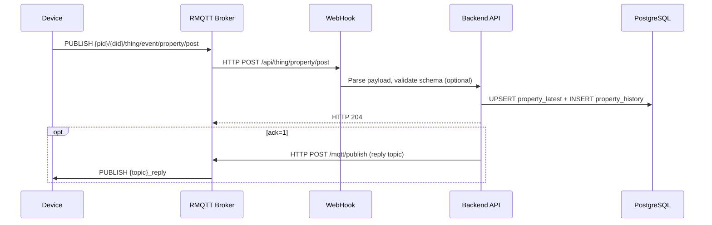
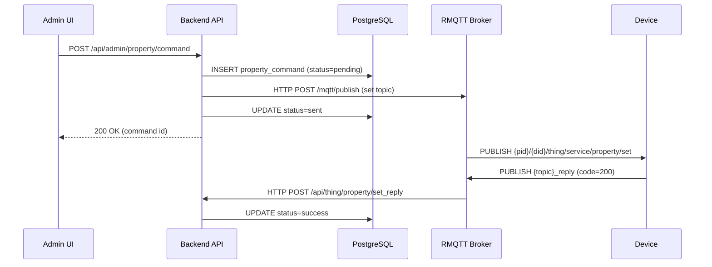
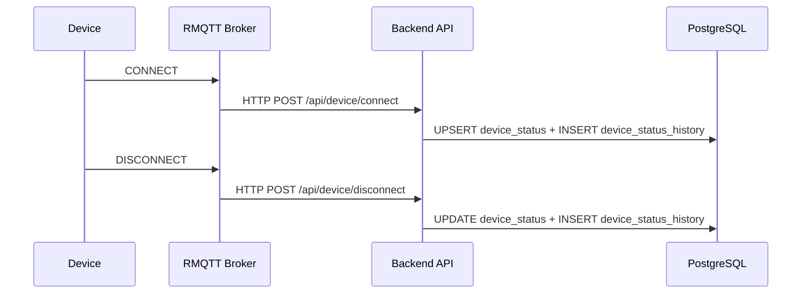

# Architecture

RMQTT Things is an IoT Thing Model backend written in Rust. It receives MQTT device data, stores it in PostgreSQL, and exposes management HTTP APIs, along with device authentication, OTA updates, and certificate issuance.

## Directory Structure

```
backend/src/
  main.rs              # Entry point: load config, connect to DB, build router, start HTTP server
  config.rs            # TOML configuration definitions (database, MQTT, cache, S3, CA, OpenTelemetry)
  cache.rs             # Schema cache (in-memory DashMap or Redis)
  rmqtt_client.rs      # RMQTT Broker HTTP API client (publish messages, query subscriptions)
  telemetry.rs         # OpenTelemetry initialization (logging, tracing, metrics)
  ca/
    mod.rs             # Self-signed CA initialization
    generator.rs       # Generate CA/server/client certificates using rcgen
  api/
    mod.rs             # Router table + OpenAPI export
    handlers.rs        # Device WebHook callbacks: property reports, event reports, online/offline, file uploads
    auth_handlers.rs   # Device authentication (HMAC-SHA1) and ACL checks
    admin_handlers.rs  # Admin CRUD: property queries, command delivery, OTA, file uploads
    product_handlers.rs # Product management CRUD
    ca_handlers.rs     # Certificate issuance and management
    ota_handlers.rs    # OTA version reporting and processing
    web_models.rs      # WebHook request/response models (RMQTT message format)
    admin_models.rs    # Admin API request/response models
    error.rs           # Unified error type
    utils.rs           # Shared utility functions
    openapi.rs         # utoipa OpenAPI spec definitions
    middleware/
      mod.rs           # Herald SSO auth middleware (Admin API permission checks)
  db/
    database.rs        # DatabaseService: data operations for properties, events, commands, device status
    models.rs          # Database models (PropertyLatest, EventHistory, CommandStatus, etc.)
    product.rs         # ProductRepo: product table operations
    cert_issue.rs      # CertIssueRepo: certificate record operations
    ota.rs             # OtaRepo: OTA version and device version operations

conf/plugins/          # RMQTT Broker plugin configuration
  rmqtt-web-hook.toml        # WebHook rules: which MQTT events are forwarded to the backend
  rmqtt-auth-http.toml       # Authentication and ACL HTTP callback addresses
  rmqtt-auto-subscription.toml # Topics auto-subscribed after device connection
  rmqtt-acl.toml             # Static ACL rules

backend/migrations/    # SQLx database migration scripts
```

The frontend is a standalone React SPA, served by the backend's `ServeDir` after build. The source lives in `frontend/src/`, using React 19 + TanStack Router/Query + Tailwind 4 + Vite 7.

## Technology Choices

### Rust + Axum

Rust wasn't chosen to show off. In IoT scenarios the device count can be large, and a single backend instance needs to handle many concurrent connections and data writes. Rust's async runtime (Tokio) uses less memory than Node.js/Python and gives finer memory control than Go. Axum is a web framework maintained by the Tokio team with natural Tower middleware ecosystem compatibility -- routing, parameter extraction, and middleware composition are straightforward.

### WebHook Instead of Direct MQTT Subscription

The backend doesn't subscribe to MQTT Broker topics directly. Device data comes in via WebHook. The reason is decoupling: the backend doesn't need to maintain long-lived MQTT connections, a Broker outage doesn't affect queries on existing data, and restarting the backend won't lose messages (the Broker retries WebHooks). The trade-off is an extra HTTP hop, but IoT device report rates are typically on the order of seconds, so this latency is negligible.

### SQLx Instead of ORM

SQLx does compile-time SQL checking. When you write `sqlx::query!()`, you know immediately whether the SQL syntax is correct and what the return types are. ORMs like SeaORM introduce heavy generic nesting in Rust, making debugging difficult, and complex queries require workarounds. This project's queries aren't particularly complex -- hand-written SQL with `QueryBuilder` is more straightforward.

### rcgen Self-Signed CA

Production environments use internal CAs or Let's Encrypt, but IoT device certificates are different: there are many devices, they need batch issuance, and CNs must contain productId/deviceId. rcgen is a pure Rust certificate generation library that doesn't require OpenSSL. The CA is generated once with `--generate-ca`; at runtime it is only loaded/validated (BYO-CA: startup fails if missing).

### Cache: In-Memory or Redis

The schema cache supports two backends: `DashMap` (in-memory hash map) for single instances, and Redis for clusters. In-memory mode has zero dependencies and is sufficient for development and small-scale deployments. Redis mode shares cache across multiple instances. Switching only requires changing `cache_type` in the config.

## Core Data Flows

Property reporting is the most frequent operation in the system. The data path from device to database:



Admin property command delivery flow:



Device online/offline events are pushed by the Broker:



## Module Overview

### api/ -- Routes and Handlers

Routes are split into two groups: device-side and admin-side. Device-side routes (`/api/thing/*`, `/api/device/*`, `/api/access/*`) receive RMQTT Broker WebHook callbacks with no authentication requirement, since the Broker already validates device identity. Admin routes (`/api/admin/*`) serve the backend UI CRUD endpoints. When Herald is configured, these routes are protected by `herald_auth_middleware` for SSO authentication and permission checks (see [Authentication & Authorization](auth-en.md)). Without Herald, admin routes have no authentication.

The route table is defined in `create_router()` in `api/mod.rs`, using Axum's method-router style where the same path can chain GET/POST/DELETE registrations.

State is split across two structs: `AppState` for device-side handlers and `AdminAppState` for admin-side. Both share the same `DatabaseService` and `SchemaCache`, each holding their own `RmqttHttpClient` (since `reqwest::Client` has an internal connection pool, keeping them separate avoids conflicts).

### db/ -- Database Operations

`DatabaseService` is the core entry point, wrapping a `PgPool`. Property and event operations are written directly in `database.rs` using `QueryBuilder` for dynamic SQL assembly (since query conditions are optional). Products, certificates, and OTA each have their own Repo struct, obtained via factory methods on `DatabaseService`.

Model definitions live in `models.rs`. Enum types (`CommandStatus`, `DeviceConnectionStatus`) use `#[repr(i16)]` mapped to PostgreSQL `int2`, decoded through sqlx's custom type handling.

### cache.rs -- Schema Cache

The cache stores one thing: product property schemas (JSON Schema). When a device reports properties and schema validation is enabled, the backend first fetches the schema from cache; if missing, it loads from the database and writes it back. Validation uses the `jsonschema` crate.

`SchemaCache` is an enum: `InMemory` uses `DashMap`, `Redis` uses the `redis` crate. Both implement the `SchemaCacheManager` trait. The choice is made in the config file and cannot be switched at runtime.

### rmqtt_client.rs -- RMQTT HTTP Client

The backend needs to send messages to the Broker (reply to devices, deliver commands). Instead of using the MQTT protocol, it calls RMQTT's HTTP API `/mqtt/publish` directly. This way the backend doesn't maintain a long-lived MQTT connection -- fire and forget.

`publish_command()` has a retry mechanism: 2 retries by default, 1-second interval. `publish_response()` does not retry -- if a reply is lost, the device will time out and resend.

`check_client_online()` and `get_subscriptions()` are used before delivering commands to check whether the device is online and has subscribed to the command topic.

### ca/ -- Certificate Management

At startup, `load_ca()` only validates that `conf/ca.pem` and `conf/ca.key` exist and are valid — startup fails if they are missing or invalid (BYO-CA). The CA and server certificate are generated once via `rmqtt-things --generate-ca` (refuses to overwrite if already present). The CA has a default validity of 100 years. The server certificate is signed after the CA is generated, with CN set to the configured domain (wildcards supported).

Client certificates are issued on demand, with CN in the format `{productId}/{deviceId}`, used for mTLS scenarios. Issuance records are stored in the `cert_issue` table.

### config.rs -- Configuration

Loaded from a TOML file, path specified via the `APP_CONFIG` environment variable, defaulting to `config.toml`. Configuration is divided into six sections: database URL, MQTT connection parameters, OpenTelemetry endpoint, API settings (enable Swagger, enable schema validation, static file path), cache type and Redis URL, and S3 configuration.

## Device Authentication and ACL Flow

When a device connects to the Broker, it goes through two layers of checks: authentication (who are you) and authorization (what can you do).

### Authentication

RMQTT's `rmqtt-auth-http` plugin sends an HTTP request to the backend when a device sends CONNECT. The backend's `/api/access/auth` verifies the password using HMAC-SHA1.

Password format: `{nonce}.{timestamp}.{hmac_sha1_hex}`

Verification process:

1. Split the password, check that nonce is 6 characters and timestamp format is correct
2. Reject if the timestamp differs from current time by more than 300 seconds (5 minutes). Prevents replay attacks.
3. Use the configured `suffix` as the key, compute HMAC-SHA1 over `{clientId}.{nonce}.{timestamp}.{suffix}`
4. Compare hashes. If they match, return `"allow"`; otherwise `"deny"`

The RMQTT plugin is configured with `deny_if_error = true` -- if the backend is down, connections are rejected outright. Better to deny devices than to let unauthenticated ones in.

### ACL

After a device passes authentication, every PUBLISH or SUBSCRIBE triggers an ACL check. The backend's `/api/access/acl` does topic-level authorization with simple rules:

1. The second segment of the topic (deviceId) must equal the clientId. A device can only operate on its own topics.
2. The first segment of the topic (productId) must equal the username.
3. Only `thing/event/*`, `thing/service/*`, `ota/upgrade`, and `ota/version` topic patterns are allowed.
4. Everything else is denied.

The Broker also has a static ACL (`rmqtt-acl.toml`) that blocks subscriptions to `$SYS/#` and `#`, and allows devices to pub/sub under `{clientId}/#`. The static ACL is evaluated before the HTTP ACL and short-circuits on match.

### Auto-Subscription

After a device connects, the `rmqtt-auto-subscription` plugin automatically subscribes it to the following topics:

| Topic | Purpose |
|-------|---------|
| `+/{deviceId}/thing/service/property/set` | Receive property set commands |
| `+/{deviceId}/thing/event/property/post_reply` | Receive property report replies |
| `+/{deviceId}/thing/event/file/upload_reply` | Receive file upload credentials |
| `+/{deviceId}/ota/upgrade` | Receive OTA upgrade notifications |
| `+/{deviceId}/ota/version_reply` | OTA version query replies |

The `+` wildcard matches productId, so changing the product ID doesn't affect subscriptions.

## MQTT Topic Design

Topic format follows the Thing Model specification: `{productId}/{deviceId}/thing/{direction}/{type}/{action}`. For the full protocol definition (topic list, payload format, reply mechanism), see the [Thing Model Specification](thing-model-spec-en.md).

| Direction | Topic Pattern | Description |
|-----------|--------------|-------------|
| Device report | `{p}/{d}/thing/event/property/post` | Property report |
| Device report | `{p}/{d}/thing/event/test/post` | Event report |
| Device report | `{p}/{d}/thing/service/property/set_reply` | Property set result |
| Device report | `{p}/{d}/thing/file/upload` | Request upload credentials |
| Device report | `{p}/{d}/ota/version` | Report current version |
| Platform command | `{p}/{d}/thing/service/property/set` | Property set command |
| Platform reply | `{topic}_reply` | Reply on the same topic path |

`{p}` = productId, `{d}` = deviceId. The reply topic simply appends `_reply` to the original topic, no separate path.

Payloads are JSON with three core fields: `id` (request ID for correlating request and reply), `params` (business data), and `ack` (0 = no reply needed, 1 = reply needed). Replies include a `code` field with semantics matching HTTP status codes, where 200 indicates success.
