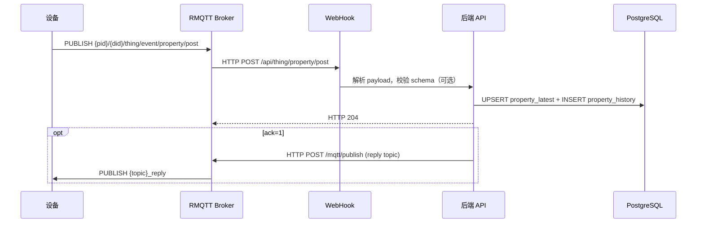
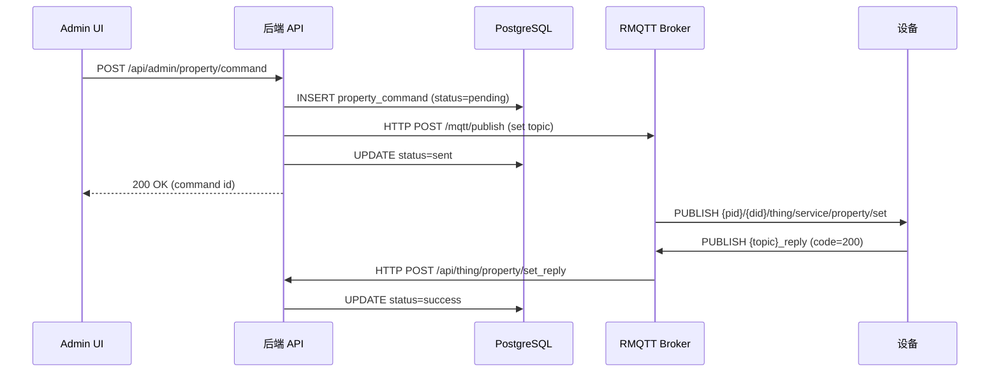
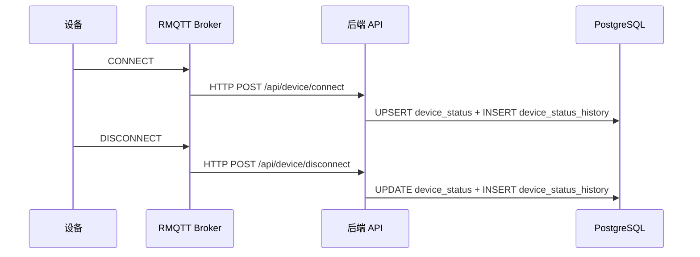

# 架构

RMQTT Things 是一个用 Rust 写的 IoT 物模型后端，接收 MQTT 设备数据、存 PostgreSQL、提供管理 HTTP API，顺带做设备认证、OTA、证书签发。

## 目录结构

```
backend/src/
  main.rs              # 启动入口：读配置、连数据库、建路由、启动 HTTP 服务
  config.rs            # TOML 配置定义（数据库、MQTT、缓存、S3、CA、OpenTelemetry）
  cache.rs             # Schema 缓存（内存 DashMap 或 Redis）
  rmqtt_client.rs      # 调 RMQTT Broker 的 HTTP API（发布消息、查订阅）
  telemetry.rs         # OpenTelemetry 初始化（日志、链路、指标）
  ca/
    mod.rs             # 自签 CA 初始化
    generator.rs       # 用 rcgen 生成 CA/服务端/客户端证书
  api/
    mod.rs             # 路由表 + OpenAPI 导出
    handlers.rs        # 设备 WebHook 回调：属性上报、事件上报、上下线、文件上传
    auth_handlers.rs   # 设备认证（HMAC-SHA1）和 ACL 校验
    admin_handlers.rs  # 管理后台 CRUD：属性查询、命令下发、OTA、文件上传
    product_handlers.rs # 产品管理 CRUD
    ca_handlers.rs     # 证书签发和管理
    ota_handlers.rs    # OTA 版本上报和处理
    web_models.rs      # WebHook 请求/响应模型（RMQTT 消息格式）
    admin_models.rs    # Admin API 请求/响应模型
    error.rs           # 统一错误类型
    utils.rs           # 共享工具函数
    openapi.rs         # utoipa OpenAPI spec 定义
    middleware.rs       # HTTP 中间件
  db/
    database.rs        # DatabaseService：属性、事件、命令、设备状态的数据操作
    models.rs          # 数据库模型（PropertyLatest、EventHistory、CommandStatus 等）
    product.rs         # ProductRepo：产品表操作
    cert_issue.rs      # CertIssueRepo：证书记录操作
    ota.rs             # OtaRepo：OTA 版本和设备版本操作

conf/plugins/          # RMQTT Broker 插件配置
  rmqtt-web-hook.toml        # WebHook 规则：哪些 MQTT 事件转发到后端
  rmqtt-auth-http.toml       # 认证和 ACL 的 HTTP 回调地址
  rmqtt-auto-subscription.toml # 设备连接后自动订阅的 topic
  rmqtt-acl.toml             # 静态 ACL 规则

backend/migrations/    # SQLx 数据库迁移脚本
```

前端是个独立的 React SPA，打包后由后端的 `ServeDir` 直接托管。源码在 `frontend/src/`，用的是 React 19 + TanStack Router/Query + Tailwind 4 + Vite 7。

## 技术选型

### Rust + Axum

选 Rust 不为了炫技。IoT 场景下设备数量可能很大，单个后端实例要扛住大量并发连接和数据写入。Rust 的异步运行时（Tokio）在这件事上比 Node.js/Python 省内存，比 Go 有更精细的内存控制。Axum 是 Tokio 团队维护的 Web 框架，和 Tower 中间件生态天然兼容，写路由、提取参数、组合中间件都算直接。

### WebHook 而不是直接订阅 MQTT

后端不直接连 MQTT Broker 做订阅。设备数据走 WebHook 进来。原因是解耦：后端不需要维护 MQTT 长连接，Broker 挂了不影响已有数据的查询，重启后端也不会丢消息（Broker 会重试 WebHook）。代价是多一次 HTTP 跳转，但 IoT 设备上报频率通常在秒级，这点延迟可以忽略。

### SQLx 而不是 ORM

SQLx 做编译期 SQL 检查，写 `sqlx::query!()` 的时候就知道 SQL 语法对不对、返回类型是什么。SeaORM 之类的 ORM 在 Rust 里会引入大量泛型嵌套，调试困难，遇到复杂查询反而要绕一大圈。这个项目的查询不算复杂，手写 SQL 配合 `QueryBuilder` 更直观。

### rcgen 自签 CA

生产环境会用内网 CA 或 Let's Encrypt，但 IoT 设备证书不一样：设备数量多、需要批量签发、CN 里要塞 productId/deviceId。rcgen 是纯 Rust 的证书生成库，不需要装 OpenSSL，可以在启动时自动生成 CA。

### 缓存：内存 or Redis

Schema 缓存支持两种后端：单机用 `DashMap`（内存哈希表），集群用 Redis。内存模式零依赖，开发和小规模部署够用。Redis 模式用于多实例部署时共享缓存。切换只需要改配置里的 `cache_type`。

## 核心数据流

设备上报属性是系统里最频繁的操作。数据从设备到数据库的路径：



管理后台下发属性命令的流程：



设备上下线由 Broker 主动推送：



## 模块说明

### api/ -- 路由和 Handler

路由分两组：设备侧和管理侧。设备侧（`/api/thing/*`、`/api/device/*`、`/api/access/*`）接收 RMQTT Broker 的 WebHook 回调，没有认证要求，因为 Broker 本身已经校验了设备身份。管理侧（`/api/admin/*`）是给后台 UI 用的 CRUD 接口，目前没有鉴权中间件，部署时靠网络隔离保护。

路由表在 `api/mod.rs` 的 `create_router()` 里定义，用了 Axum 的 method-router 写法，同一个路径可以链式注册 GET/POST/DELETE。

状态通过两个 struct 分开：`AppState` 给设备侧 handler，`AdminAppState` 给管理侧。两者共享同一个 `DatabaseService` 和 `SchemaCache`，各自持有一份 `RmqttHttpClient`（因为 reqwest::Client 内部有连接池，分开不冲突）。

### db/ -- 数据库操作

`DatabaseService` 是核心入口，包装了 `PgPool`。属性和事件相关的操作直接写在 `database.rs` 里，用 `QueryBuilder` 动态拼接 SQL（因为查询条件是可选的）。产品、证书、OTA 各有独立的 Repo struct，从 `DatabaseService` 的工厂方法获取。

模型定义在 `models.rs`。枚举类型（`CommandStatus`、`DeviceConnectionStatus`）用 `#[repr(i16)]` 映射到 PostgreSQL 的 `int2`，通过 sqlx 的自定义类型解码。

### cache.rs -- Schema 缓存

缓存只存一件事：产品的属性 Schema（JSON Schema）。设备上报属性时，如果开启了 schema 校验，后端会先从缓存取 Schema，没有就从数据库加载然后写回缓存。用 `jsonschema` crate 做校验。

`SchemaCache` 是个 enum，`InMemory` 用 `DashMap`，`Redis` 用 `redis` crate。两者都实现 `SchemaCacheManager` trait。选择哪种在配置文件里决定，运行时不能切换。

### rmqtt_client.rs -- RMQTT HTTP 客户端

后端需要往 Broker 发消息（回复设备、下发命令），不走 MQTT 协议，直接调 RMQTT 的 HTTP API `/mqtt/publish`。这样后端不需要维护 MQTT 长连接，发完就走。

`publish_command()` 有重试机制，默认重试 2 次，间隔 1 秒。`publish_response()` 不重试，回复丢了就丢了，设备会超时重发。

`check_client_online()` 和 `get_subscriptions()` 用于下发命令前检查设备是否在线、是否已订阅了命令 topic。

### ca/ -- 证书管理

启动时调用 `init_ca()`，检查 `conf/ca.pem` 和 `conf/ca.key` 是否存在、是否有效。不存在或无效就重新生成。CA 默认有效期 100 年。服务端证书在 CA 生成后签发，CN 是配置里的 domain（支持通配符）。

客户端证书按需签发，CN 格式是 `{productId}/{deviceId}`，用于 mTLS 场景。签发记录存 `cert_issue` 表。

### config.rs -- 配置

从 TOML 文件加载，路径通过环境变量 `APP_CONFIG` 指定，默认 `config.toml`。配置项分六块：数据库 URL、MQTT 连接参数、OpenTelemetry 端点、API 设置（是否开 Swagger、是否校验 Schema、静态文件路径）、缓存类型和 Redis URL、S3 配置。

## 设备认证和 ACL 流程

设备连接 Broker 时经过两层校验：认证（你是谁）和授权（你能干什么）。

### 认证

RMQTT 的 `rmqtt-auth-http` 插件在设备 CONNECT 时向后端发 HTTP 请求。后端的 `/api/access/auth` 用 HMAC-SHA1 验证密码。

密码格式：`{nonce}.{timestamp}.{hmac_sha1_hex}`

验证过程：

1. 拆分密码，检查 nonce 长度 6 位、时间戳格式正确
2. 时间戳与当前时间差超过 300 秒（5 分钟），拒绝。防重放攻击
3. 用配置里的 `suffix` 作为密钥，对 `{clientId}.{nonce}.{timestamp}.{suffix}` 算 HMAC-SHA1
4. 比对哈希值，一致返回 `"allow"`，否则 `"deny"`

RMQTT 插件配置了 `deny_if_error = true`，后端挂了直接拒绝连接。宁可设备连不上，也不能让未认证的设备进来。

### ACL

设备认证通过后，每次 PUBLISH 或 SUBSCRIBE 都会触发 ACL 检查。后端 `/api/access/acl` 做的是主题级授权，规则很简单：

1. topic 的第二段（deviceId）必须等于 clientId。设备只能操作自己的 topic
2. topic 的第一段（productId）必须等于 username
3. 只允许 `thing/event/*`、`thing/service/*`、`ota/upgrade`、`ota/version` 这几类 topic
4. 其他全部 deny

Broker 还配了静态 ACL（`rmqtt-acl.toml`），禁止订阅 `$SYS/#` 和 `#`，允许设备在 `{clientId}/#` 下做 pub/sub。静态 ACL 在 HTTP ACL 之前执行，命中就短路。

### 自动订阅

设备连接后，`rmqtt-auto-subscription` 插件自动帮设备订阅以下 topic：

| Topic | 用途 |
|-------|------|
| `+/{deviceId}/thing/service/property/set` | 接收属性设置命令 |
| `+/{deviceId}/thing/event/property/post_reply` | 收到属性上报的回复 |
| `+/{deviceId}/thing/event/file/upload_reply` | 收到文件上传凭证 |
| `+/{deviceId}/ota/upgrade` | 接收 OTA 升级通知 |
| `+/{deviceId}/ota/version_reply` | OTA 版本查询回复 |

通配符 `+` 匹配 productId，这样产品 ID 改了不影响订阅。

## MQTT Topic 设计

Topic 格式遵循物模型规范：`{productId}/{deviceId}/thing/{direction}/{type}/{action}`。完整的协议定义（topic 列表、payload 格式、reply 机制）见 [物模型协议规范](thing-model-spec.md)。

| 方向 | Topic 模式 | 说明 |
|------|-----------|------|
| 设备上报 | `{p}/{d}/thing/event/property/post` | 属性上报 |
| 设备上报 | `{p}/{d}/thing/event/test/post` | 事件上报 |
| 设备上报 | `{p}/{d}/thing/service/property/set_reply` | 属性设置结果 |
| 设备上报 | `{p}/{d}/thing/file/upload` | 请求上传凭证 |
| 设备上报 | `{p}/{d}/ota/version` | 上报当前版本 |
| 平台下发 | `{p}/{d}/thing/service/property/set` | 属性设置命令 |
| 平台回复 | `{topic}_reply` | 原路返回的回复 |

`{p}` = productId，`{d}` = deviceId。回复 topic 就是在原 topic 后面加 `_reply`，不另起路径。

Payload 是 JSON，核心字段三个：`id`（请求 ID，用于关联请求和回复）、`params`（业务数据）、`ack`（0 = 不需要回复，1 = 需要回复）。回复里有 `code` 字段，语义和 HTTP 状态码一致，200 表示成功。
