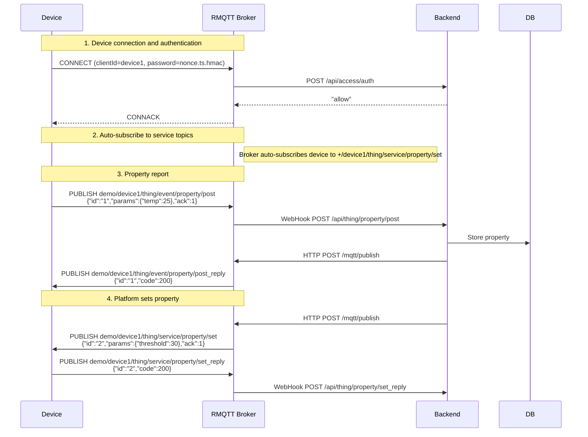

# Thing Model Protocol Specification

Devices communicate with the platform through a set of MQTT protocol conventions. This set of conventions is called the "Thing Model" -- it defines what data devices can report, what commands the platform can send, and what the message formats look like.

If you are developing device firmware or need to integrate with this protocol, this chapter has everything you need.

## Two Communication Directions

Interactions between devices and the platform fall into two categories:

1. **Event Reporting**. The device proactively reports status, measurements, or any event to the platform. Property reporting (temperature, humidity, etc.) is essentially a type of event reporting.
2. **Service Invocation (RPC)**. The platform sends a command to the device, such as setting a property threshold or triggering an OTA upgrade.

If a Thing Model template (JSON Schema) is assigned to the device, reported data will be validated against it. Non-compliant data is rejected. Templates are configured in the admin backend; see the validation template section in the [API Reference](api-reference-en.md).

## MQTT Topic Design

Topic format: `{productId}/{deviceId}/thing/{direction}/{type}/{action}`

- `{productId}`: ID of the product the device belongs to
- `{deviceId}`: Unique ID of the device

There are only two directions: `event` (device reports to platform) and `service` (platform sends to device).

### Event Reporting

Devices publish data to the platform using this topic:

```
{productId}/{deviceId}/thing/event/{event_type}/post
```

When `event_type` is `property`, this is a property report. `event_type` can be customized -- `alarm`, `error`, etc., all work.

### Service Invocation

The platform sends commands to a device on:

```
{productId}/{deviceId}/thing/service/{service_type}/set
```

When `service_type` is `property`, this is a property set command. The device executes it and returns the result via the reply topic.

### Reply Mechanism

For any request that requires a reply, the reply topic is the original topic with a `_reply` suffix:

```
# Request
{productId}/{deviceId}/thing/service/property/set

# Reply
{productId}/{deviceId}/thing/service/property/set_reply
```

This rule applies to all topics, not just property set.

### Complete Topic List

| Direction | Topic | Purpose |
|-----------|-------|---------|
| Device -> Platform | `{p}/{d}/thing/event/property/post` | Property report |
| Device -> Platform | `{p}/{d}/thing/event/{type}/post` | Custom event report |
| Device -> Platform | `{p}/{d}/thing/service/property/set_reply` | Property set result reply |
| Device -> Platform | `{p}/{d}/thing/file/upload` | Request file upload credential |
| Device -> Platform | `{p}/{d}/ota/version` | Report current firmware version |
| Platform -> Device | `{p}/{d}/thing/service/property/set` | Property set command |
| Reply | `{topic}_reply` | Reply to any request on the original topic |

`{p}` = productId, `{d}` = deviceId.

## Message Format

All messages are JSON.

### Request Format

Requests from the device (event reports) and from the platform (service invocations) share the same format:

```json
{
  "id": "unique-request-id",
  "params": {
    "temperature": 25.3
  },
  "ack": 1
}
```

| Field | Type | Required | Description |
|-------|------|----------|-------------|
| `id` | string | Yes | Unique request identifier for correlating requests and responses. UUID or timestamp are both fine |
| `params` | object | No | Business data. For property reports this is key-value pairs; for service invocations these are command parameters |
| `ack` | integer | Yes | `0` = no reply needed, `1` = reply required |

Setting `ack` to `0` saves a round-trip, which is useful for high-frequency reporting (e.g., reporting temperature every second) where platform confirmation is unnecessary. Setting `ack` to `1` guarantees the device receives the platform's processing result.

### Response Format

Replies to requests with `ack=1` use this format:

```json
{
  "id": "same-id-as-the-request",
  "data": {
    "result": "ok"
  },
  "code": 200
}
```

| Field | Type | Required | Description |
|-------|------|----------|-------------|
| `id` | string | Yes | The original request ID; the device uses this to match the corresponding request |
| `data` | object | No | Returned business data |
| `code` | integer | Yes | Status code, using HTTP status code semantics. 200-299 means success, anything else means failure |

`code` reuses HTTP status code semantics directly, so there is no separate error code scheme to learn.

## Device Authentication

Devices must pass authentication when connecting to the MQTT broker. RMQTT's `rmqtt-auth-http` plugin forwards authentication requests to the backend, which verifies them using HMAC-SHA1.

### Password Format

```
{6-char-random-nonce}.{unix-timestamp}.{hmac_sha1_hex}
```

Signature algorithm:

```
hmac_sha1_hex(shared_key, "{clientId}.{nonce}.{timestamp}.{suffix}")
```

- `shared_key`: the `suffix` field from configuration
- `clientId`: the device's client ID
- `nonce`: 6-character random string
- `timestamp`: unix timestamp (seconds)
- `suffix`: the `suffix` field from configuration (same value as shared_key)

### Verification Flow

1. Split the password and verify the nonce is 6 characters and the timestamp format is correct
2. If the timestamp differs from the current time by more than the configured tolerance (default 300 seconds), reject. This prevents replay attacks
3. Compute HMAC-SHA1 of `{clientId}.{nonce}.{timestamp}.{suffix}` using `suffix` as the key
4. Compare the hash values

If the backend is unavailable, the connection is denied (`deny_if_error = true`). It is better to refuse a legitimate device than to allow an unauthenticated one.

### ACL Permissions

After authentication passes, every PUBLISH or SUBSCRIBE is checked against ACL rules. The rules are straightforward:

1. The second segment of the topic (deviceId) must equal the clientId. A device can only operate on its own topics
2. The first segment of the topic (productId) must equal the username
3. Only `thing/event/*`, `thing/service/*`, and `ota/*` topic patterns are allowed
4. Everything else is denied

### Auto-Subscription

After a device connects, the broker automatically subscribes to the following topics on its behalf. The device does not need to send SUBSCRIBE packets:

| Topic | Purpose |
|-------|---------|
| `+/{deviceId}/thing/service/property/set` | Receive property set commands |
| `+/{deviceId}/thing/event/property/post_reply` | Reply to property reports |
| `+/{deviceId}/thing/file/upload_reply` | File upload credential |
| `+/{deviceId}/ota/upgrade` | OTA upgrade notification |
| `+/{deviceId}/ota/version_reply` | OTA version query reply |

The `+` wildcard matches the productId, so a change in product ID does not affect subscriptions.

## TLS and Certificates

TLS is recommended for production. Two options:

**One-way TLS**: The server has a certificate, and the device verifies the server's identity. Simple to deploy and sufficient for most scenarios.

**Mutual TLS (mTLS)**: Both sides have certificates and verify each other. Higher security, but more complex certificate management.

This project uses a self-signed CA to generate certificates. The CA validity period defaults to 100 years. The CN (Common Name) field of client certificates issued to devices uses the format `{productId}/{deviceId}`, so the broker can parse the device identity from the CN.

There are two questions in mTLS implementations that have no universally standard answer:
1. Should device credential information be included in the client certificate?
2. If so, which field should be used?

There are currently four common approaches: CN/SAN fields, certificate serial number, custom extensions, and TLS-layer client certificate fingerprint. This project uses the CN field because it is the most intuitive -- during debugging you can tell at a glance which device a certificate belongs to.

## OTA Upgrade Protocol

### Version Number Encoding

Version format: `major.minor.patch`, with up to 2 major digits + 2 minor digits + 3 patch digits, mapped to a 7-digit integer.

For example, `1.2.34` = `102034`, `12.5.100` = `125100`.

Integer encoding makes comparison easy: a simple numeric comparison tells you which version is newer.

### Reporting Version

Topic: `{productId}/{deviceId}/ota/version`

A device may have multiple MCUs (main controller, camera module, etc.), each requiring independent upgrades. Therefore `params` is an array, with `key` identifying each module:

```json
{
  "id": "req-001",
  "params": [
    {"key": "main", "version": "1.0.0"},
    {"key": "camera", "version": "1.2.0"}
  ],
  "ack": 0
}
```

### Delivering Upgrade Package

Topic: `{productId}/{deviceId}/ota/upgrade`

```json
{
  "id": "req-002",
  "params": [
    {"key": "main", "file_url": "url_key"}
  ]
}
```

`file_url` is actually an S3 object key, not a directly accessible URL. After receiving it, the device needs to obtain the actual download link through other means.

The platform does not provide a topic for retrieving download links because CDN authentication strategies vary across deployments and cannot be unified. The device side needs to construct its own download request based on `file_url`.

## File Upload

Device requests an upload credential:

Topic: `{productId}/{deviceId}/thing/file/upload`

Platform returns the upload credential:

Topic: `{productId}/{deviceId}/thing/file/upload_reply`

After receiving the credential, the device uploads the file directly to S3.

## Device Connection Status

The broker's WebHook notifies the backend when devices connect and disconnect. The backend records:

- Event history for each connection and disconnection
- Duration of each connection session
- Timestamp of the last disconnection

This information is queryable through the admin backend; see the device status section in the [API Reference](api-reference-en.md).

## End-to-End Interaction Example

A complete property report and property set interaction flow:


