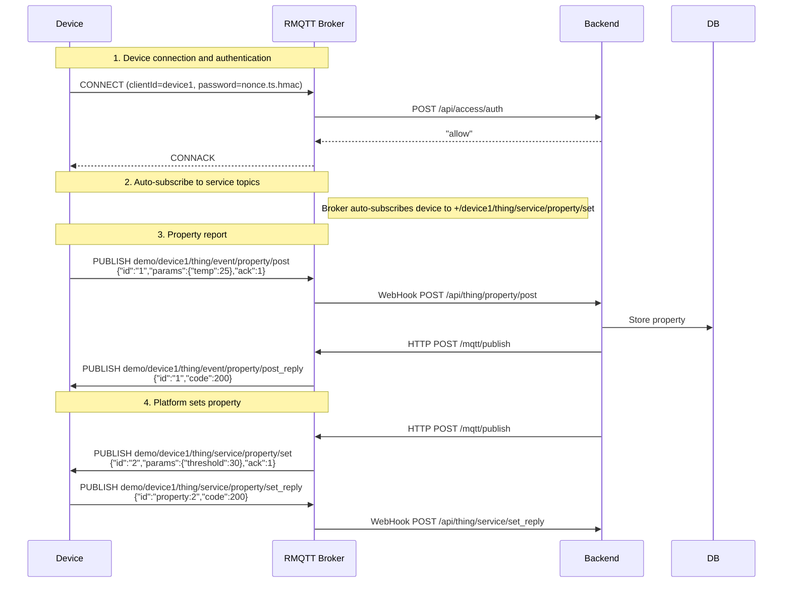

# Thing Model Protocol Specification

Devices communicate with the platform through a set of MQTT protocol conventions. This set of conventions is called the "Thing Model" -- it defines what data devices can report, what commands the platform can send, and what the message formats look like.

If you are developing device firmware or need to integrate with this protocol, this chapter has everything you need.

## Two Communication Directions

Interactions between devices and the platform fall into two categories:

1. **Event Reporting**. The device proactively reports status, measurements, or any event to the platform. Property reporting (temperature, humidity, etc.) is essentially a type of event reporting.
2. **Service Invocation (RPC)**. The platform sends a command to the device, such as setting a property threshold or triggering an OTA upgrade.

If a product has an Active Thing Model template (JSON Schema) for the corresponding property or event, reported data is validated against it and non-compliant data is rejected. Reports pass through when no corresponding Active template exists. Templates are configured in the admin backend; see the validation template section in the [API Reference](api-reference-en.md).

## MQTT Topic Design

Event and service invocation topic format:

`{productId}/{deviceId}/thing/{direction}/{type}/{action}`

File upload, factory metadata, and OTA are separate topic families and do not use this template. See the [Complete Topic List](#complete-topic-list).

- `{productId}`: ID of the product the device belongs to
- `{deviceId}`: Unique ID of the device

There are only two directions: `event` (device reports to platform) and `service` (platform sends to device).

### Event Reporting

Devices publish data to the platform using this topic:

```
{productId}/{deviceId}/thing/event/{event_type}/post
```

When `event_type` is `property`, this is a property report. `event_type` can be customized -- `alarm`, `error`, etc., all work.

### Service Invocation

The platform sends commands to a device on:

```
{productId}/{deviceId}/thing/service/{service_type}/set
```

When `service_type` is `property`, this is a property set command. Other valid identifiers represent actions or service invocations, such as `reboot` or `unlock`. The device executes the request and returns the result via the reply topic. The protocol does not enumerate `service_type`; it must match `[a-zA-Z0-9_-]` and be 1–32 characters long.

#### Action / service invocation

An action is a one-shot downlink command, semantically separate from property sets:

- Actions never enter the desired/reported state view and do not participate in shadow convergence.
- The action's `set_reply` represents the "execution result" and does not update the reported snapshot; only a subsequent `thing/event/property/post` updates reported.
- An admin initiates an action invocation (with `params`, e.g. `{"delaySeconds": 5}`) from the management API; the platform delivers them one by one in `created_time` order.
- Action invocations for offline devices are queued and delivered once the device subscribes to the service topic (reusing the existing command channel's queue and ack mechanism).
- Replies follow the unified response format: any `code` in the 2xx range means success, anything else means failure.

Action example (platform -> device, `ack=1` requires a reply):

```json
{
  "id": "action:42",
  "params": {"delaySeconds": 5},
  "ack": 1
}
```

Device reply:

```json
{
  "id": "action:42",
  "data": {"result": "accepted"},
  "code": 202
}
```

The `id` is generated by the platform and is opaque to the device; the device returns it unchanged. For action invocation history and management endpoints, see the Action / service invocation section of the [API reference](api-reference-en.md).

### Reply Mechanism

For any request that requires a reply, the reply topic is the original topic with a `_reply` suffix:

```
# Request
{productId}/{deviceId}/thing/service/property/set

# Reply
{productId}/{deviceId}/thing/service/property/set_reply
```

This rule applies to all topics, not just property set.

### Complete Topic List

| Direction | Topic | Purpose |
|-----------|-------|---------|
| Device -> Platform | `{p}/{d}/thing/event/property/post` | Property report |
| Device -> Platform | `{p}/{d}/thing/event/{type}/post` | Custom event report |
| Device -> Platform | `{p}/{d}/thing/service/property/set_reply` | Property set result reply |
| Device -> Platform | `{p}/{d}/thing/service/{service_type}/set_reply` | Action / service invocation result |
| Device -> Platform | `{p}/{d}/thing/file/upload` | Request file upload credential |
| Device -> Platform | `{p}/{d}/thing/factory-metadata/get` | Fetch factory metadata |
| Device -> Platform | `{p}/{d}/ota/version` | Report current firmware version |
| Platform -> Device | `{p}/{d}/thing/service/property/set` | Property set command |
| Platform -> Device | `{p}/{d}/thing/service/{service_type}/set` | Action / service invocation |
| Platform -> Device | `{p}/{d}/thing/factory-metadata/get_reply` | Return factory metadata |
| Reply | `{topic}_reply` | Reply to any request on the original topic |

`{p}` = productId, `{d}` = deviceId.

> **On device shadow**: the device shadow (desired/reported) **introduces no new topics**. The platform delivers the delta between desired and reported over the existing `thing/service/property/set` channel; the device is unaware of it. See the [Device Shadow](#device-shadow) section.
>
> When `{service_type}` is `property`, the property-specific semantics in the table apply; actions use other identifiers. WebHook and ACL wildcard rules must not cause property to match both a dedicated rule and a wildcard rule.

## Message Format

All messages are JSON.

### Request Format

Requests from the device (event reports) and from the platform (service invocations) share the same format:

```json
{
  "id": "unique-request-id",
  "params": {
    "temperature": 25.3
  },
  "ack": 1
}
```

| Field | Type | Required | Description |
|-------|------|----------|-------------|
| `id` | string | Yes | Unique request identifier for correlating requests and responses. UUID or timestamp are both fine |
| `params` | object or array | No | Business data. Event reports and service invocations must use an object; OTA version/upgrade uses an array as defined in its section |
| `ack` | integer | Yes | `0` = no reply needed, `1` = reply required |

Setting `ack` to `0` saves a round-trip, which is useful for high-frequency reporting (e.g., reporting temperature every second) where platform confirmation is unnecessary. Setting `ack` to `1` requests a processing result from the receiver; actual delivery guarantees still depend on MQTT QoS and connection state.

`id` is an opaque unique string generated by the requester. The receiver must not parse or modify it and must return it unchanged in the reply. Each MQTT PUBLISH carries exactly one request; no batched `ids` / `items` variant is defined.

When `ack=0`, the receiver must not publish a `_reply`. Requests that need business data back, such as upload credentials or factory metadata, must use `ack=1`.

### Response Format

Replies to requests with `ack=1` use this format:

```json
{
  "id": "same-id-as-the-request",
  "data": {
    "result": "ok"
  },
  "code": 200
}
```

| Field | Type | Required | Description |
|-------|------|----------|-------------|
| `id` | string | Yes | The original request ID; the device uses this to match the corresponding request |
| `data` | object | No | Returned business data. Omit it when there is no data; do not substitute a string or `null` |
| `code` | integer | Yes | Status code, using HTTP status code semantics. 200-299 means success, anything else means failure |

`code` reuses HTTP status code semantics directly, so there is no separate error code scheme to learn.

## Device Authentication

Devices must pass authentication when connecting to the MQTT broker. RMQTT's `rmqtt-auth-http` plugin forwards authentication requests to the backend, which verifies them using HMAC-SHA1.

### Password Format

```
{6-char-random-nonce}.{unix-timestamp}.{hmac_sha1_hex}
```

Signature algorithm:

```
hmac_sha1_hex(shared_key, "{clientId}.{nonce}.{timestamp}.{suffix}")
```

- `shared_key`: the `suffix` field from configuration
- `clientId`: the device's client ID
- `nonce`: 6-character random string
- `timestamp`: unix timestamp (seconds)
- `suffix`: the `suffix` field from configuration (same value as shared_key)

### Verification Flow

1. Split the password and verify the nonce is 6 characters and the timestamp format is correct
2. If the timestamp differs from the current time by more than the configured tolerance (default 300 seconds), reject. This prevents replay attacks
3. Compute HMAC-SHA1 of `{clientId}.{nonce}.{timestamp}.{suffix}` using `suffix` as the key
4. Compare the hash values

If the backend is unavailable, the connection is denied (`deny_if_error = true`). It is better to refuse a legitimate device than to allow an unauthenticated one.

### ACL Permissions

After authentication passes, every PUBLISH or SUBSCRIBE is checked against ACL rules. The rules are straightforward:

1. The second segment of the topic (deviceId) must equal the clientId. A device can only operate on its own topics
2. The first segment of the topic (productId) must equal the username
3. Only `thing/event/*`, `thing/service/*`, `thing/file/*`, `thing/factory-metadata/*`, and `ota/*` topic patterns are allowed
4. Everything else is denied

### Auto-Subscription

After a device connects, the broker automatically subscribes to the following topics on its behalf. The device does not need to send SUBSCRIBE packets:

| Topic | Purpose |
|-------|---------|
| `+/{deviceId}/thing/service/+/set` | Receive property sets and actions / service invocations |
| `+/{deviceId}/thing/event/+/post_reply` | Reply to property and custom event reports |
| `+/{deviceId}/thing/file/upload_reply` | File upload credential |
| `+/{deviceId}/thing/factory-metadata/get_reply` | Factory metadata |
| `+/{deviceId}/ota/upgrade` | OTA upgrade notification |
| `+/{deviceId}/ota/version_reply` | OTA version query reply |

The `+` wildcard matches the productId, so a change in product ID does not affect subscriptions.

> Device shadow reuses `thing/service/property/set` to deliver deltas and needs no additional auto-subscription entry. The broker uses a single unified wildcard subscription `+/{deviceId}/thing/service/+/set` for every `service_type`, shared by property and actions; no overlapping dedicated rule is kept.

## TLS and Certificates

TLS is recommended for production. Two options:

**One-way TLS**: The server has a certificate, and the device verifies the server's identity. Simple to deploy and sufficient for most scenarios.

**Mutual TLS (mTLS)**: Both sides have certificates and verify each other. Higher security, but more complex certificate management.

This project uses a self-signed CA to generate certificates. The CA validity period defaults to 100 years. The CN (Common Name) field of client certificates issued to devices uses the format `{productId}/{deviceId}`, so the broker can parse the device identity from the CN.

There are two questions in mTLS implementations that have no universally standard answer:
1. Should device credential information be included in the client certificate?
2. If so, which field should be used?

There are currently four common approaches: CN/SAN fields, certificate serial number, custom extensions, and TLS-layer client certificate fingerprint. This project uses the CN field because it is the most intuitive -- during debugging you can tell at a glance which device a certificate belongs to.

## OTA Upgrade Protocol

### Version Number Encoding

The device protocol carries the version as a `major.minor.patch` string: major and minor range from 0–99, and patch ranges from 0–999. The platform pads the three segments to 2, 2, and 3 digits and then converts the result to an integer for internal storage and comparison; the integer representation does not retain leading zeroes.

For example, `1.2.34` = `102034`, `12.5.100` = `125100`.

Integer encoding makes comparison easy: a simple numeric comparison tells you which version is newer.

### Reporting Version

Topic: `{productId}/{deviceId}/ota/version`

A device may have multiple MCUs (main controller, camera module, etc.), each requiring independent upgrades. Therefore `params` is an array, with `key` identifying each module:

```json
{
  "id": "req-001",
  "params": [
    {"key": "main", "version": "1.0.0"},
    {"key": "camera", "version": "1.2.0"}
  ],
  "ack": 0
}
```

### Delivering Upgrade Package

Topic: `{productId}/{deviceId}/ota/upgrade`

```json
{
  "id": "req-002",
  "params": [
    {"key": "main", "file_url": "url_key"}
  ],
  "ack": 0
}
```

`file_url` is a legacy field name whose value is an S3 object key, not a directly accessible URL. After receiving it, the device obtains the actual download link using the deployment-specific mechanism.

The platform does not provide a topic for retrieving download links because CDN authentication strategies vary across deployments and cannot be unified. The device side needs to construct its own download request based on `file_url`.

## File Upload

Device requests an upload credential:

Topic: `{productId}/{deviceId}/thing/file/upload`

The request must set `ack=1`.

Platform returns the upload credential:

Topic: `{productId}/{deviceId}/thing/file/upload_reply`

After receiving the credential, the device uploads the file directly to S3.

## Factory Metadata

The device requests its own factory metadata:

Topic: `{productId}/{deviceId}/thing/factory-metadata/get`

The request must set `ack=1`. The platform replies on the original topic plus `_reply`. When metadata exists, it is returned in the response `data` object; when no metadata exists, `data` is omitted.

## Device Shadow

> **Key clarification**: device shadow is a **platform-side state model**, transparent to the device. The device is never aware of desired -- it still only receives property set commands from the existing `thing/service/property/set` topic and replies via `set_reply` as usual. **No device-side change is required**. This section describes how the platform uses desired/reported/delta behind the scenes to maintain the "desired state" view.

### Three concepts

| Name | Meaning | Who writes it |
|------|---------|---------------|
| **desired** | The platform-side persisted view of "what state this device should be in" | Only written by the admin via Set-Desired; one-shot commands and device reports never write it |
| **reported** | The device's actually reported current state (the property report snapshot) | Reported by the device via `thing/event/property/post` |
| **delta** | The per-property difference between desired and reported | Computed by the platform, read-only |

desired and reported are each stored once on the platform, organized by `(product_id, device_id)`. delta is not stored -- it is a difference view computed on each query.

### Impact on the device: zero

The way a device participates in the shadow is identical to how it participates in a normal property set:

1. The admin sets a desired state (Set-Desired); the platform computes the delta
2. If the delta is non-empty, the platform delivers it as a normal property command over `thing/service/property/set`
3. The device executes it like any property set and replies via `thing/service/property/set_reply`
4. `set_reply` updates only the command success/failure status. The device then reports its actual properties through `thing/event/property/post`; only that report updates the reported snapshot. Once reported catches up to desired, that property disappears from the delta

**The device does not need to understand desired, does not need to subscribe to a new topic, and does not need a firmware change.** The shadow is just a layer of "desired state + delta computation + convergence judgment" that the platform adds on top of the existing property command channel.

### Passive convergence

The platform **does not** automatically re-push whenever the device reports a value that deviates from desired. desired is a "persistent intent view", not an auto-controller:

- The platform computes the current delta and attempts a single delivery **only when the admin explicitly calls Set-Desired**
- If the device reports a value different from desired, the platform merely shows "pending convergence" in the delta view -- it **does not auto-send a command**
- It is up to the admin to decide whether to Set-Desired again

### Set-Desired merge rules

Set-Desired accepts a patch (a partial set of properties) and merges it into the current desired document with these rules:

- **Non-null value**: overwrites the desired value of that property
- **null value**: **deletes** that desired property (aligns with the null-delete semantics of AWS IoT Shadow / Azure IoT Hub)
- Properties absent from the patch: unchanged

Clearing the entire desired document is done with a patch where every property is `null`; there is no separate delete endpoint.

### Difference from one-shot property commands

| | One-shot property command | Shadow (desired/reported) |
|---|---|---|
| Semantics | A one-shot action | A persistent desired state |
| Remembered by the platform? | No, fire-and-forget | Yes, persisted |
| Convergence | None | Yes; delta clears once reported catches up to desired |
| Knows "whether it was achieved"? | Only command success/failure | Yes; `delta == empty` means achieved |

The temporary value of a one-shot command **does not** pollute the desired view (desired takes precedence). The two coexist and do not reference each other.

### Shadow convergence example

```mermaid
sequenceDiagram
    participant A as Admin
    participant S as Backend
    participant B as RMQTT Broker
    participant D as Device

    Note over A,S: 1. Admin sets the desired state
    A->>S: PUT /api/admin/property/shadow/desired<br/>{"brightness": 80}
    S->>S: merge into desired, compute delta<br/>(brightness missing from reported -> non-empty delta)
    Note over S: delta is delivered over the property command channel, no new topic

    Note over S,D: 2. Deliver delta via the existing property/set channel
    S->>B: HTTP POST /mqtt/publish
    B->>D: PUBLISH {p}/{d}/thing/service/property/set<br/>{"id":"2","params":{"brightness":80},"ack":1}

    Note over D,S: 3. Device executes and replies (identical to a normal property set)
    D->>B: PUBLISH {p}/{d}/thing/service/property/set_reply<br/>{"id":"property:2","code":200}
    B->>S: WebHook POST /api/thing/service/set_reply
    S->>S: mark command Success (desired is not written)

    Note over D,S: 4. Device reports current state, reported catches up to desired
    D->>B: PUBLISH {p}/{d}/thing/event/property/post<br/>{"id":"3","params":{"brightness":80},"ack":0}
    B->>S: WebHook POST /api/thing/property/post
    S->>S: update reported snapshot; recompute delta -> empty (converged)

    Note over A,S: 5. Admin queries, sees convergence
    A->>S: GET /api/admin/property/shadow
    S-->>A: desired={brightness:80}, reported={brightness:80}, delta={}
```

> Note step 4: even if the device reports a value different from desired, the platform **does not auto-re-push**; it just leaves the delta showing "pending convergence". The example above is the normal path where the device happens to converge to the desired value.

For the admin-side shadow APIs (set desired, query desired/reported/delta), see the device shadow section of the [API Reference](api-reference-en.md).

## Device Connection Status

The broker's WebHook notifies the backend when devices connect and disconnect. The backend records:

- Event history for each connection and disconnection
- Duration of each connection session
- Timestamp of the last disconnection

This information is queryable through the admin backend; see the device status section in the [API Reference](api-reference-en.md).

## End-to-End Interaction Example

A complete property report and property set interaction flow:


```mermaid
sequenceDiagram
    participant D as Device
    participant B as RMQTT Broker
    participant S as Backend

    Note over D,B: 1. Device connection and authentication
    D->>B: CONNECT (clientId=device1, password=nonce.ts.hmac)
    B->>S: POST /api/access/auth
    S-->>B: "allow"
    B-->>D: CONNACK

    Note over D,B: 2. Auto-subscribe to service topics
    Note right of B: Broker auto-subscribes device to +/device1/thing/service/property/set

    Note over D,B: 3. Property report
    D->>B: PUBLISH demo/device1/thing/event/property/post<br/>{"id":"1","params":{"temp":25},"ack":1}
    B->>S: WebHook POST /api/thing/property/post
    S->>DB: Store property
    S->>B: HTTP POST /mqtt/publish
    B->>D: PUBLISH demo/device1/thing/event/property/post_reply<br/>{"id":"1","code":200}

    Note over D,B: 4. Platform sets property
    S->>B: HTTP POST /mqtt/publish
    B->>D: PUBLISH demo/device1/thing/service/property/set<br/>{"id":"2","params":{"threshold":30},"ack":1}
    D->>B: PUBLISH demo/device1/thing/service/property/set_reply<br/>{"id":"property:2","code":200}
    B->>S: WebHook POST /api/thing/service/set_reply
```
