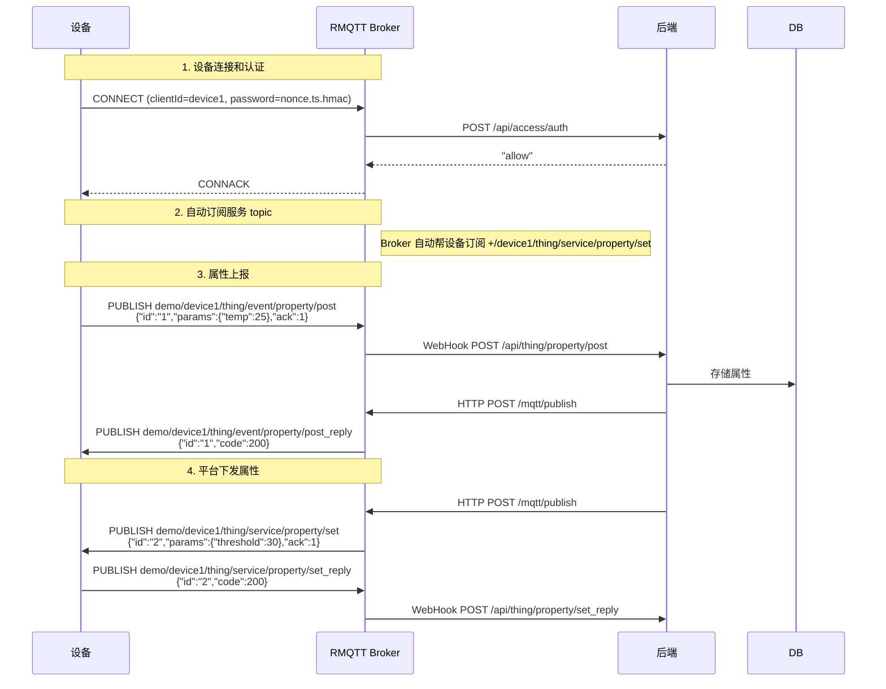

# 物模型协议规范

设备跟平台之间怎么通信，靠的是一套 MQTT 协议约定。这套约定叫"物模型"，定义了设备能上报什么数据、平台能下发什么命令、消息格式长什么样。

如果你在开发设备端固件，或者需要对接这套协议，这章就是你需要的全部。

## 物模型的两种通信方向

设备跟平台的交互分两种：

1. **事件上报**。设备主动向平台报告状态、测量值或任何事件。属性上报（温度、湿度这类）本质上也是一种事件上报。
2. **服务调用（RPC）**。平台向设备发送命令，比如设置属性阈值、触发OTA升级。

如果设备安装了物模型模板（JSON Schema），上报的数据会被校验。不合规的数据会被拒绝。模板在管理后台配置，详见 [API 参考](api-reference.md) 的校验模板部分。

## MQTT Topic 设计

Topic 格式：`{productId}/{deviceId}/thing/{direction}/{type}/{action}`

- `{productId}`：设备所属产品的 ID
- `{deviceId}`：设备的唯一 ID

方向只有两个：`event`（设备上报）和 `service`（平台下发）。

### 事件上报

设备向平台发布数据用这个 topic：

```
{productId}/{deviceId}/thing/event/{event_type}/post
```

当 `event_type` 是 `property` 时，就是属性上报。`event_type` 可以自定义，比如 `alarm`、`error` 都行。

### 服务调用

平台向设备发送命令：

```
{productId}/{deviceId}/thing/service/{service_type}/set
```

`service_type` 为 `property` 时是属性设置。设备收到后执行，然后把结果通过 reply topic 返回。

### Reply 机制

任何需要回复的请求，reply topic 就是原 topic 加 `_reply` 后缀：

```
# 请求
{productId}/{deviceId}/thing/service/property/set

# 回复
{productId}/{deviceId}/thing/service/property/set_reply
```

这条规则对所有 topic 都适用，不是只给属性设置用的。

### 完整的 Topic 列表

| 方向 | Topic | 用途 |
|------|-------|------|
| 设备上报 | `{p}/{d}/thing/event/property/post` | 属性上报 |
| 设备上报 | `{p}/{d}/thing/event/{type}/post` | 自定义事件上报 |
| 设备上报 | `{p}/{d}/thing/service/property/set_reply` | 属性设置结果回复 |
| 设备上报 | `{p}/{d}/thing/file/upload` | 请求文件上传凭证 |
| 设备上报 | `{p}/{d}/ota/version` | 上报当前固件版本 |
| 平台下发 | `{p}/{d}/thing/service/property/set` | 属性设置命令 |
| 平台回复 | `{topic}_reply` | 任何请求的原路回复 |

`{p}` = productId，`{d}` = deviceId。

## 消息格式

所有消息都是 JSON。

### 请求格式

设备发出的请求（事件上报）和平台发出的请求（服务调用）格式一样：

```json
{
  "id": "唯一请求ID",
  "params": {
    "temperature": 25.3
  },
  "ack": 1
}
```

| 字段 | 类型 | 必填 | 说明 |
|------|------|------|------|
| `id` | string | 是 | 请求唯一标识，用于关联请求和响应。UUID 或时间戳都行 |
| `params` | object | 否 | 业务数据。属性上报时是属性键值对，服务调用时是命令参数 |
| `ack` | integer | 是 | `0` = 不需要回复，`1` = 需要回复 |

`ack` 设成 `0` 可以省掉一次来回，适合高频上报场景（比如每秒报一次温度），不需要平台确认。设成 `1` 则保证设备能收到平台的处理结果。

### 响应格式

回复 `ack=1` 的请求时用这个格式：

```json
{
  "id": "跟请求里的id一致",
  "data": {
    "result": "ok"
  },
  "code": 200
}
```

| 字段 | 类型 | 必填 | 说明 |
|------|------|------|------|
| `id` | string | 是 | 原始请求的 ID，设备拿这个匹配对应的请求 |
| `data` | object | 否 | 返回的业务数据 |
| `code` | integer | 是 | 状态码，语义跟 HTTP 一致。200-299 表示成功，其他表示失败 |

`code` 直接复用 HTTP 状态码的语义，不用另学一套。

## 设备认证

设备连接 MQTT Broker 时要过认证关。RMQTT 的 `rmqtt-auth-http` 插件把认证请求转发给后端，后端用 HMAC-SHA1 验证。

### 密码格式

```
{6位随机nonce}.{unix时间戳}.{hmac_sha1_hex}
```

签名算法：

```
hmac_sha1_hex(shared_key, "{clientId}.{nonce}.{timestamp}.{suffix}")
```

- `shared_key`：配置里的 `suffix` 字段
- `clientId`：设备的客户端 ID
- `nonce`：6 位随机字符串
- `timestamp`：unix 时间戳（秒）
- `suffix`：配置里的 `suffix` 字段（和 shared_key 是同一个值）

### 验证流程

1. 拆分密码，检查 nonce 长度 6 位、时间戳格式正确
2. 时间戳和当前时间差超过配置的容差（默认 300 秒），拒绝。防重放攻击
3. 用 suffix 作为密钥，对 `{clientId}.{nonce}.{timestamp}.{suffix}` 算 HMAC-SHA1
4. 比对哈希值

后端挂了直接拒绝连接（`deny_if_error = true`），宁可设备连不上也不放未认证设备进来。

### ACL 权限

认证通过后，每次 PUBLISH 或 SUBSCRIBE 都会检查 ACL。规则很简单：

1. topic 的第二段（deviceId）必须等于 clientId。设备只能操作自己的 topic
2. topic 的第一段（productId）必须等于 username
3. 只允许 `thing/event/*`、`thing/service/*`、`ota/*` 这几类 topic
4. 其他全部 deny

### 自动订阅

设备连接后，Broker 会自动帮设备订阅这些 topic，不用设备自己发 SUBSCRIBE：

| Topic | 用途 |
|-------|------|
| `+/{deviceId}/thing/service/property/set` | 接收属性设置命令 |
| `+/{deviceId}/thing/event/property/post_reply` | 属性上报的回复 |
| `+/{deviceId}/thing/file/upload_reply` | 文件上传凭证 |
| `+/{deviceId}/ota/upgrade` | OTA 升级通知 |
| `+/{deviceId}/ota/version_reply` | OTA 版本查询回复 |

通配符 `+` 匹配 productId，这样产品 ID 变了也不影响订阅。

## TLS 和证书

生产环境建议用 TLS。两种方案：

**单向 TLS**：服务端有证书，设备验证服务端身份。部署简单，大多数场景够用。

**双向 TLS（mTLS）**：双方都有证书，互相验证。安全性更高，但证书管理复杂。

本项目用自签名 CA 生成证书。CA 有效期默认 100 年。签发给设备的客户端证书 CN 字段格式是 `{productId}/{deviceId}`，Broker 可以从 CN 里解析出设备身份。

mTLS 实现中有两个没有标准答案的问题：
1. 客户端证书里要不要放设备凭证信息？
2. 放的话用什么字段？

目前常见的方案有四种：CN/SAN 字段、证书序列号、自定义扩展（Custom Extension）、TLS 层 client cert fingerprint。本项目选择了 CN 字段，因为它最直观，调试时一眼就能看出是哪个设备的证书。

## OTA 升级协议

### 版本号编码

版本号格式：`主版本.次版本.修订版本`，最多 2 位主版本 + 2 位次版本 + 3 位修订版本，映射成 7 位整数。

比如 `1.2.34` = `102034`，`12.5.100` = `125100`。

整数编码方便比较大小：直接比数字就知道哪个版本更新。

### 上报版本

Topic：`{productId}/{deviceId}/ota/version`

一个设备可能有多个 MCU（主控、摄像头模组等），每个需要独立升级。所以 `params` 是个数组，用 `key` 区分：

```json
{
  "id": "req-001",
  "params": [
    {"key": "main", "version": "1.0.0"},
    {"key": "camera", "version": "1.2.0"}
  ],
  "ack": 0
}
```

### 下发升级包

Topic：`{productId}/{deviceId}/ota/upgrade`

```json
{
  "id": "req-002",
  "params": [
    {"key": "main", "file_url": "url_key"}
  ]
}
```

`file_url` 实际上是 S3 的 object key，不是直接可访问的 URL。设备拿到后需要通过其他方式获取实际的下载链接。

平台不提供获取下载链接的 topic，因为各家 CDN 的鉴权策略不一样，没法统一。设备端需要根据 `file_url` 自己构造下载请求。

## 文件上传

设备请求上传凭证：

Topic：`{productId}/{deviceId}/thing/file/upload`

平台返回上传凭证：

Topic：`{productId}/{deviceId}/thing/file/upload_reply`

设备拿到凭证后直接往 S3 上传文件。

## 设备连接状态

Broker 的 WebHook 会在设备连接和断开时通知后端。后端记录的内容包括：

- 每次连接和断开的事件历史
- 每次连接的持续时长
- 最后一次断开的时间

这些信息在管理后台可以查询，详见 [API 参考](api-reference.md) 的设备状态部分。

## 实际对接示例

一个完整的属性上报和设置的交互流程：


