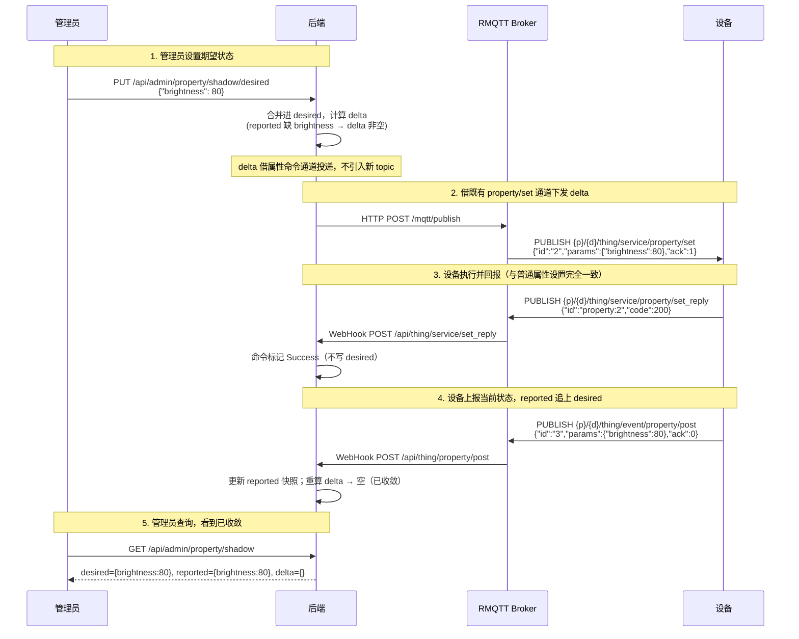
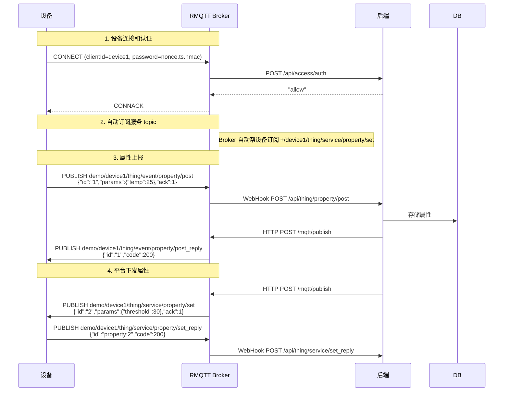

# 物模型协议规范

设备跟平台之间怎么通信，靠的是一套 MQTT 协议约定。这套约定叫"物模型"，定义了设备能上报什么数据、平台能下发什么命令、消息格式长什么样。

如果你在开发设备端固件，或者需要对接这套协议，这章就是你需要的全部。

## 物模型的两种通信方向

设备跟平台的交互分两种：

1. **事件上报**。设备主动向平台报告状态、测量值或任何事件。属性上报（温度、湿度这类）本质上也是一种事件上报。
2. **服务调用（RPC）**。平台向设备发送命令，比如设置属性阈值、触发OTA升级。

如果产品为对应的属性或事件配置了 Active 状态的物模型模板（JSON Schema），上报的数据会被校验，不合规的数据会被拒绝。没有对应 Active 模板时直接放行。模板在管理后台配置，详见 [API 参考](api-reference.md) 的校验模板部分。

## MQTT Topic 设计

事件和服务调用的 Topic 格式：

`{productId}/{deviceId}/thing/{direction}/{type}/{action}`

文件上传、出厂元数据和 OTA 是独立的 Topic 族，不套用这个模板，见[完整的 Topic 列表](#完整的-topic-列表)。

- `{productId}`：设备所属产品的 ID
- `{deviceId}`：设备的唯一 ID

方向只有两个：`event`（设备上报）和 `service`（平台下发）。

### 事件上报

设备向平台发布数据用这个 topic：

```
{productId}/{deviceId}/thing/event/{event_type}/post
```

当 `event_type` 是 `property` 时，就是属性上报。`event_type` 可以自定义，比如 `alarm`、`error` 都行。

### 服务调用

平台向设备发送命令：

```
{productId}/{deviceId}/thing/service/{service_type}/set
```

`service_type` 为 `property` 时是属性设置；其他合法标识表示动作或服务调用，例如 `reboot`、`unlock`。设备收到后执行，然后把结果通过 reply topic 返回。`service_type` 不由协议枚举，允许字符为 `[a-zA-Z0-9_-]`，长度 1–32。

#### 动作 / 服务调用（action）

动作是一次性的下行命令，与属性设置语义分离：

- 动作不进入 desired/reported 状态视图，不参与影子收敛。
- 动作的 `set_reply` 表示「执行结果」，不更新 reported 快照；只有后续 `thing/event/property/post` 才更新 reported。
- 管理员通过管理端发起动作调用（带入参 `params`，例如 `{"delaySeconds": 5}`），平台按 `created_time` 顺序逐条投递。
- 离线设备的动作调用排队，设备订阅服务主题后投递（复用既有命令通道的排队与 ack 机制）。
- 动作调用的回复遵循统一响应格式：`code` 任意 2xx 表示成功，其它表示失败。

动作示例（平台下发，`ack=1` 要求设备回报）：

```json
{
  "id": "action:42",
  "params": {"delaySeconds": 5},
  "ack": 1
}
```

设备回复：

```json
{
  "id": "action:42",
  "data": {"result": "accepted"},
  "code": 202
}
```

`id` 由平台生成，对设备是不透明字符串，设备原样回填即可。动作调用的历史与管理端接口见 [API 参考](api-reference.md) 的动作 / 服务调用部分。

### Reply 机制

任何需要回复的请求，reply topic 就是原 topic 加 `_reply` 后缀：

```
# 请求
{productId}/{deviceId}/thing/service/property/set

# 回复
{productId}/{deviceId}/thing/service/property/set_reply
```

这条规则对所有 topic 都适用，不是只给属性设置用的。

### 完整的 Topic 列表

| 方向 | Topic | 用途 |
|------|-------|------|
| 设备上报 | `{p}/{d}/thing/event/property/post` | 属性上报 |
| 设备上报 | `{p}/{d}/thing/event/{type}/post` | 自定义事件上报 |
| 设备上报 | `{p}/{d}/thing/service/property/set_reply` | 属性设置结果回复 |
| 设备上报 | `{p}/{d}/thing/service/{service_type}/set_reply` | 动作 / 服务调用结果回复 |
| 设备上报 | `{p}/{d}/thing/file/upload` | 请求文件上传凭证 |
| 设备上报 | `{p}/{d}/thing/factory-metadata/get` | 拉取出厂元数据 |
| 设备上报 | `{p}/{d}/ota/version` | 上报当前固件版本 |
| 平台下发 | `{p}/{d}/thing/service/property/set` | 属性设置命令 |
| 平台下发 | `{p}/{d}/thing/service/{service_type}/set` | 动作 / 服务调用 |
| 平台回复 | `{p}/{d}/thing/factory-metadata/get_reply` | 返回出厂元数据 |
| 平台回复 | `{topic}_reply` | 任何请求的原路回复 |

`{p}` = productId，`{d}` = deviceId。

> **关于设备影子**：影子设备（desired/reported）**不新增 topic**。平台把 desired 与 reported 的差异（delta）通过既有的 `thing/service/property/set` 通道投递给设备，设备端无感知。详见 [设备影子](#设备影子-device-shadow) 章节。
>
> `{service_type}` 为 `property` 时使用表中的 property 专用语义；动作使用其他标识。实现 WebHook 或 ACL 通配规则时要避免让 property 同时命中专用规则和通配规则。

## 消息格式

所有消息都是 JSON。

### 请求格式

设备发出的请求（事件上报）和平台发出的请求（服务调用）格式一样：

```json
{
  "id": "唯一请求ID",
  "params": {
    "temperature": 25.3
  },
  "ack": 1
}
```

| 字段 | 类型 | 必填 | 说明 |
|------|------|------|------|
| `id` | string | 是 | 请求唯一标识，用于关联请求和响应。UUID 或时间戳都行 |
| `params` | object 或 array | 否 | 业务数据。事件上报和服务调用必须是 object；OTA version/upgrade 按对应章节使用 array |
| `ack` | integer | 是 | `0` = 不需要回复，`1` = 需要回复 |

`ack` 设成 `0` 可以省掉一次来回，适合高频上报场景（比如每秒报一次温度），不需要平台确认。设成 `1` 表示请求接收方返回处理结果；实际送达保证仍由 MQTT QoS 和连接状态决定。

`id` 是由请求方生成的不透明唯一字符串。接收方不得解析或改写它，回复时必须原样返回。每个 MQTT PUBLISH 只承载一个请求，不定义批量 `ids` / `items` 变体。

`ack=0` 时接收方不得发布 `_reply`；需要返回上传凭证、出厂元数据等业务数据的请求必须使用 `ack=1`。

### 响应格式

回复 `ack=1` 的请求时用这个格式：

```json
{
  "id": "跟请求里的id一致",
  "data": {
    "result": "ok"
  },
  "code": 200
}
```

| 字段 | 类型 | 必填 | 说明 |
|------|------|------|------|
| `id` | string | 是 | 原始请求的 ID，设备拿这个匹配对应的请求 |
| `data` | object | 否 | 返回的业务数据。没有数据时省略，不使用字符串或 `null` 代替 |
| `code` | integer | 是 | 状态码，语义跟 HTTP 一致。200-299 表示成功，其他表示失败 |

`code` 直接复用 HTTP 状态码的语义，不用另学一套。

## 设备认证

设备连接 MQTT Broker 时要过认证关。RMQTT 的 `rmqtt-auth-http` 插件把认证请求转发给后端，后端用 HMAC-SHA1 验证。

### 密码格式

```
{6位随机nonce}.{unix时间戳}.{hmac_sha1_hex}
```

签名算法：

```
hmac_sha1_hex(shared_key, "{clientId}.{nonce}.{timestamp}.{suffix}")
```

- `shared_key`：配置里的 `suffix` 字段
- `clientId`：设备的客户端 ID
- `nonce`：6 位随机字符串
- `timestamp`：unix 时间戳（秒）
- `suffix`：配置里的 `suffix` 字段（和 shared_key 是同一个值）

### 验证流程

1. 拆分密码，检查 nonce 长度 6 位、时间戳格式正确
2. 时间戳和当前时间差超过配置的容差（默认 300 秒），拒绝。防重放攻击
3. 用 suffix 作为密钥，对 `{clientId}.{nonce}.{timestamp}.{suffix}` 算 HMAC-SHA1
4. 比对哈希值

后端挂了直接拒绝连接（`deny_if_error = true`），宁可设备连不上也不放未认证设备进来。

### ACL 权限

认证通过后，每次 PUBLISH 或 SUBSCRIBE 都会检查 ACL。规则很简单：

1. topic 的第二段（deviceId）必须等于 clientId。设备只能操作自己的 topic
2. topic 的第一段（productId）必须等于 username
3. 只允许 `thing/event/*`、`thing/service/*`、`thing/file/*`、`thing/factory-metadata/*`、`ota/upgrade`、`ota/version` 这几类 topic
4. 其他全部 deny

### 自动订阅

设备连接后，Broker 会自动帮设备订阅这些 topic，不用设备自己发 SUBSCRIBE：

| Topic | 用途 |
|-------|------|
| `+/{deviceId}/thing/service/+/set` | 接收属性设置及动作 / 服务调用 |
| `+/{deviceId}/thing/event/+/post_reply` | 属性及自定义事件上报的回复 |
| `+/{deviceId}/thing/file/upload_reply` | 文件上传凭证 |
| `+/{deviceId}/thing/factory-metadata/get_reply` | 出厂元数据 |
| `+/{deviceId}/ota/upgrade` | OTA 升级通知 |
| `+/{deviceId}/ota/version_reply` | OTA 版本查询回复 |

通配符 `+` 匹配 productId，这样产品 ID 变了也不影响订阅。

> 设备影子复用 `thing/service/property/set` 投递 delta，不需要新增自动订阅项。Broker 对所有 `service_type` 使用统一的通配订阅 `+/{deviceId}/thing/service/+/set`，property 和动作共用，不保留会重叠命中的专用规则。

## TLS 和证书

生产环境建议用 TLS。两种方案：

**单向 TLS**：服务端有证书，设备验证服务端身份。部署简单，大多数场景够用。

**双向 TLS（mTLS）**：双方都有证书，互相验证。安全性更高，但证书管理复杂。

本项目用自签名 CA 生成证书。CA 有效期默认 100 年。签发给设备的客户端证书 CN 字段格式是 `{productId}/{deviceId}`，Broker 可以从 CN 里解析出设备身份。

mTLS 实现中有两个没有标准答案的问题：
1. 客户端证书里要不要放设备凭证信息？
2. 放的话用什么字段？

目前常见的方案有四种：CN/SAN 字段、证书序列号、自定义扩展（Custom Extension）、TLS 层 client cert fingerprint。本项目选择了 CN 字段，因为它最直观，调试时一眼就能看出是哪个设备的证书。

## OTA 升级协议

### 版本号编码

设备协议中的版本号是字符串，格式为 `主版本.次版本.修订版本`：主版本和次版本范围为 0–99，修订版本范围为 0–999。平台接收后将三段分别补齐为 2、2、3 位，再转换成整数用于内部存储和比较；整数表示不保留前导零。

比如 `1.2.34` = `102034`，`12.5.100` = `1205100`。

整数编码方便比较大小：直接比数字就知道哪个版本更新。

### 上报版本

Topic：`{productId}/{deviceId}/ota/version`

一个设备可能有多个 MCU（主控、摄像头模组等），每个需要独立升级。所以 `params` 是个数组，用 `key` 区分：

```json
{
  "id": "req-001",
  "params": [
    {"key": "main", "version": "1.0.0"},
    {"key": "camera", "version": "1.2.0"}
  ],
  "ack": 0
}
```

### 下发升级包

Topic：`{productId}/{deviceId}/ota/upgrade`

```json
{
  "id": "req-002",
  "params": [
    {"key": "main", "file_url": "url_key"}
  ],
  "ack": 0
}
```

`file_url` 是历史字段名，值实际为 S3 object key，不是直接可访问的 URL。设备拿到后需要通过部署方约定的方式获取实际下载链接。

平台不提供获取下载链接的 topic，因为各家 CDN 的鉴权策略不一样，没法统一。设备端需要根据 `file_url` 自己构造下载请求。

## 文件上传

设备请求上传凭证：

Topic：`{productId}/{deviceId}/thing/file/upload`

请求必须设置 `ack=1`。

平台返回上传凭证：

Topic：`{productId}/{deviceId}/thing/file/upload_reply`

设备拿到凭证后直接往 S3 上传文件。

## 出厂元数据

设备请求自身的出厂元数据：

Topic：`{productId}/{deviceId}/thing/factory-metadata/get`

请求必须设置 `ack=1`。平台通过原 Topic 加 `_reply` 返回结果。存在数据时放在响应的 `data` object 中；没有数据时省略 `data`。

## 设备影子 (Device Shadow)

> **关键澄清**：设备影子是**平台侧状态模型**，对设备端透明。设备感知不到 desired 的存在——它仍然只是从既有的 `thing/service/property/set` 收到属性设置命令，按原协议回报 `set_reply`。**设备端实现无需任何改动**。这一节描述的是平台如何在背后用 desired/reported/delta 来组织「期望状态」视图。

### 三个概念

| 名称 | 含义 | 谁来写 |
|------|------|--------|
| **desired** | 平台侧持久保存的「这台设备应该是什么状态」 | 只有管理员通过 Set-Desired 写入；一次性命令和设备上报都不写 |
| **reported** | 设备实际上报的当前状态（即属性上报快照） | 设备通过 `thing/event/property/post` 上报 |
| **delta** | desired 与 reported 逐属性的差异 | 平台计算，只读 |

desired 和 reported 在平台内部各存一份，按 `(product_id, device_id)` 维度组织。delta 不是存储，而是每次查询时算出来的差异视图。

### 对设备端的影响：零

设备参与影子的方式，和它参与普通属性设置完全一样：

1. 管理员设置期望状态（Set-Desired），平台算出 delta
2. delta 非空时，平台把它作为一条普通属性命令，通过 `thing/service/property/set` 下发
3. 设备收到后，像处理任何属性设置一样执行，并通过 `thing/service/property/set_reply` 回报
4. `set_reply` 只更新命令成功/失败状态；设备随后通过 `thing/event/property/post` 上报实际属性，平台才更新 reported 快照。reported 追上 desired 后，该属性从 delta 消失

**设备不需要认识 desired，不需要订阅新 topic，不需要改固件。** 影子只是平台在属性命令通道之上多加的一层「期望状态 + 差异计算 + 收敛判断」。

### 被动收敛

平台**不会**在每次设备上报偏离 desired 时自动重推。desired 是「持久的意图视图」，不是自动控制器：

- 只有管理员**显式** Set-Desired 时，平台才计算当前 delta 并尝试一次投递
- 设备上报了一个跟 desired 不一样的值，平台只是让 delta 视图显示「待收敛」，**不会自动再发命令**
- 由管理员判断是否需要再次 Set-Desired 重试

### Set-Desired 的合并规则

Set-Desired 接受一个 patch（部分属性），按以下规则合并进当前 desired 文档：

- **非 null 值**：覆盖该属性的期望值
- **null 值**：**删除**该 desired 属性（对齐 AWS IoT Shadow / Azure IoT Hub 的 null-delete 语义）
- 未出现在 patch 里的属性：保持不变

整体清空 desired 用一个所有属性都为 `null` 的 patch 实现，没有单独的删除端点。

### 与一次性属性命令的区别

| | 一次性属性命令（property command） | 影子（desired/reported） |
|---|---|---|
| 语义 | 一次性的动作 | 持久的期望状态 |
| 平台是否记住 | 否，发完即忘 | 是，持久化 |
| 收敛 | 无 | 有，reported 追上 desired 后 delta 清空 |
| 是否知道「是否达成」 | 只知道命令成功/失败 | 知道，`delta == 空` 即达成 |

一次性命令的临时值**不会**污染 desired 视图（desired 优先）。两者并存、互不引用。

### 影子收敛示例


```mermaid
sequenceDiagram
    participant A as 管理员
    participant S as 后端
    participant B as RMQTT Broker
    participant D as 设备

    Note over A,S: 1. 管理员设置期望状态
    A->>S: PUT /api/admin/property/shadow/desired<br/>{"brightness": 80}
    S->>S: 合并进 desired，计算 delta<br/>(reported 缺 brightness → delta 非空)
    Note over S: delta 借属性命令通道投递，不引入新 topic

    Note over S,D: 2. 借既有 property/set 通道下发 delta
    S->>B: HTTP POST /mqtt/publish
    B->>D: PUBLISH {p}/{d}/thing/service/property/set<br/>{"id":"2","params":{"brightness":80},"ack":1}

    Note over D,S: 3. 设备执行并回报（与普通属性设置完全一致）
    D->>B: PUBLISH {p}/{d}/thing/service/property/set_reply<br/>{"id":"property:2","code":200}
    B->>S: WebHook POST /api/thing/service/set_reply
    S->>S: 命令标记 Success（不写 desired）

    Note over D,S: 4. 设备上报当前状态，reported 追上 desired
    D->>B: PUBLISH {p}/{d}/thing/event/property/post<br/>{"id":"3","params":{"brightness":80},"ack":0}
    B->>S: WebHook POST /api/thing/property/post
    S->>S: 更新 reported 快照；重算 delta → 空（已收敛）

    Note over A,S: 5. 管理员查询，看到已收敛
    A->>S: GET /api/admin/property/shadow
    S-->>A: desired={brightness:80}, reported={brightness:80}, delta={}
```

> 注意第 4 步：即使设备上报的值跟 desired 不同，平台**也不会自动重推**，只是让 delta 显示「待收敛」。上面的例子是设备恰好收敛到期望值的正常路径。

影子相关的管理端 API（设置期望、查询 desired/reported/delta）详见 [API 参考](api-reference.md) 的设备影子部分。

## 设备连接状态

Broker 的 WebHook 会在设备连接和断开时通知后端。后端记录的内容包括：

- 每次连接和断开的事件历史
- 每次连接的持续时长
- 最后一次断开的时间

这些信息在管理后台可以查询，详见 [API 参考](api-reference.md) 的设备状态部分。

## 实际对接示例

一个完整的属性上报和设置的交互流程：


```mermaid
sequenceDiagram
    participant D as 设备
    participant B as RMQTT Broker
    participant S as 后端

    Note over D,B: 1. 设备连接和认证
    D->>B: CONNECT (clientId=device1, password=nonce.ts.hmac)
    B->>S: POST /api/access/auth
    S-->>B: "allow"
    B-->>D: CONNACK

    Note over D,B: 2. 自动订阅服务 topic
    Note right of B: Broker 自动帮设备订阅 +/device1/thing/service/property/set

    Note over D,B: 3. 属性上报
    D->>B: PUBLISH demo/device1/thing/event/property/post<br/>{"id":"1","params":{"temp":25},"ack":1}
    B->>S: WebHook POST /api/thing/property/post
    S->>DB: 存储属性
    S->>B: HTTP POST /mqtt/publish
    B->>D: PUBLISH demo/device1/thing/event/property/post_reply<br/>{"id":"1","code":200}

    Note over D,B: 4. 平台下发属性
    S->>B: HTTP POST /mqtt/publish
    B->>D: PUBLISH demo/device1/thing/service/property/set<br/>{"id":"2","params":{"threshold":30},"ack":1}
    D->>B: PUBLISH demo/device1/thing/service/property/set_reply<br/>{"id":"property:2","code":200}
    B->>S: WebHook POST /api/thing/service/set_reply
```
